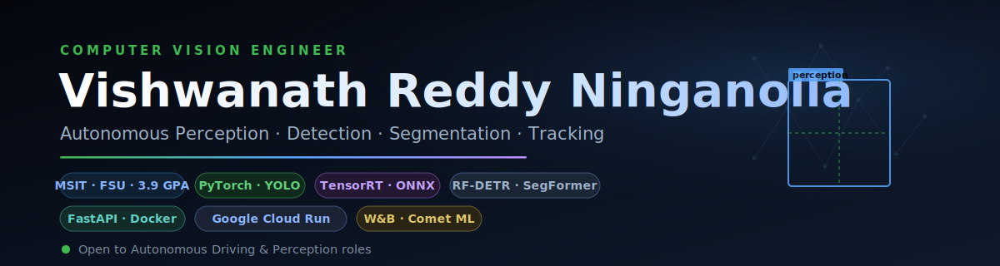

  

---

## 👋 About Me

I'm a **Computer Vision Engineer** currently pursuing my MS in Information Technology at **Florida State University** (GPA: 3.9), graduating May 2026. I build deep learning pipelines that actually work — from retinal vessel segmentation to real-time licence plate detection at 22 FPS. Previously a software engineer at HCL Tech with 2+ years building scalable data pipelines and dashboards for enterprise systems.

I care about clean model training infrastructure, good loss function design, and shipping things that run efficiently on GPU.

---

## 🔬 Featured Projects

### 🚗 Vehicle Registration Plate Detection
> YOLOv8m · Open Images Dataset · 5308 train / 386 val images

Fine-tuned YOLOv8m to detect licence plates in images and video. Converted Open Images bounding-box annotations to YOLO format, evaluated with COCO mAP metrics, and ran real-time inference at **22 FPS** on video.

> 🎬 Click to watch inference video · [click here](https://github.com/523vishwanath/vehicle-registration-plate-detection)

---

### 🩺 Retinal Blood Vessel Segmentation
> SegFormer-B3 · Albumentations · Mixed Precision · NVIDIA A100

Fine-tuned SegFormer-B3 on retinal fundus images. Designed a **Dice + Cross-Entropy loss** to address severe class imbalance (~10% vessel pixels). Tracked all experiments with Weights & Biases.

**Result: 78.02% mIoU** across thin and thick vessel structures.

---

### 🚦 Small Traffic Light Detection
> YOLOv8x · SAHI Slicing Inference · NVIDIA A100

Built an end-to-end detection system for tiny traffic lights (Red / Yellow / Green / Wait-On) in high-resolution images. Used tile-based fine-tuning and SAHI sliced inference to handle small objects.

**Result: mAP50-95 improved from 42 → 55 · mAP50: 80 · 22 FPS on video**

---

### 🛸 Drone Image Segmentation
> DeepLabV3 · PyTorch · OpenCV · Kaggle Competition

Multi-class semantic segmentation (12 classes) on drone aerial imagery. Trained for 100 epochs on NVIDIA A100 with advanced augmentation and per-class IoU analysis.

**Result: 0.57 mIoU across all 12 classes**

---

## 🛠️ Tech Stack

**Languages**

**Computer Vision & Deep Learning**

**Model Architectures**

`SegFormer` · `ViT` · `DETR` · `RT-DETR` · `DeepLabV3` · `YOLOv8` · `CNNs`

**MLOps & Infrastructure**

**Techniques**

`Mixed Precision (AMP)` · `SAHI Slicing Inference` · `Dice + CE Loss` · `Data Augmentation Pipelines` · `mIoU / mAP50-95 Evaluation`

---

## 📊 GitHub Stats

---

## 🏅 Certifications

- Advanced Vision Applications with DL & Transformers
- Deep Learning with PyTorch 2.x
- Computer Vision & Image Processing in Python — OpenCV University
- Machine Learning Specialization

---

## 💼 Experience

**HCL Tech — Software Engineer** *(Sep 2022 – Aug 2024)*
Built scalable data analysis pipelines in Python/SQL, created visualization dashboards on Google PLX, and led Agile sprint execution as POD Lead for a team of engineers.

**Capgemini — Software Engineer Intern** *(Feb 2022 – Aug 2022)*
Engineered backend modules for a Java-based banking system with MySQL/JDBC integration.

---

## 📫 Connect

---

  

